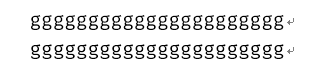
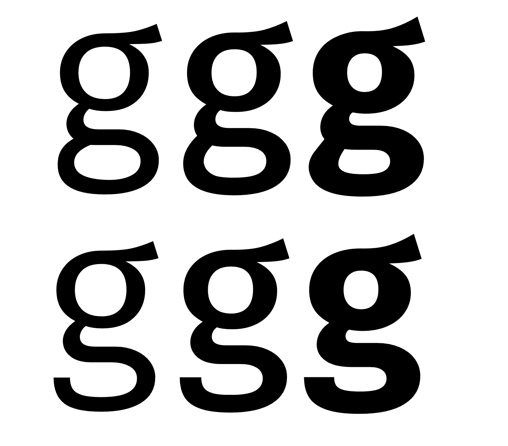

## Download


This font is a derived work from [Mozilla Fira](http://mozilla.github.io/Fira/).

+ In folder `FiraMonoMz-ttf-g` (recommended): font files with `&`, `@` and `g` modified.
  
+ In folder `FiraMonoMz-ttf`:   font files with `&` and `@` modified


## License & Difference from Fira Mono
This work is based on: [Mozilla Fira](http://mozilla.github.io/Fira/)
Currently based on commit 5c8d9b.

This work is not based on [FiraCode](https://github.com/tonsky/FiraCode). 
So Fira Mono Mz doesn't support font ligatures (I personally don't find it useful).

Just like Fira Mono, this work is also **free and open source**, 
and the license is the same as Fira Mono.

It changes following chars in Fira Mono:
+ `&`: use the design of `&` in open source font "Hack"
+ `@`: use the design of `@` in open source font "Inconsolata" 
+ `g`: slightly modify the shape, to seal the bottom part.
  This make the `g` char looks more readable and balanced in small 
  font size.

+ Fira Mono Mz: 

+ Original Fira Mono:

+ char `g` comparison in small font size: <br/>

+ char `g` comparison in large font size: <br/>

+ char `g` comparison in huge font size: <br/>



## For font hackers
We have 3 font-forge prject files:
+ `FiraMonoMz-Bold.sfdir\`: font-forge project file for font `FiraMonoMz-Bold`.
+ `FiraMonoMz-Medium.sfdir\`: font-forge project file for font `FiraMonoMz-Medium`.
+ `FiraMonoMz-Regular.sfdir\`: font-forge project file for font `FiraMonoMz-Regular`.

### Post-processing to make font be recognized as "Monospaced font"
If you make some changes to the font-forge prject, 
remember that after exporting your version of `.ttf` file using font-forge, 
you need to run following commands:
```sh
python fixmono.py FiraMonoMz-Regular.ttf
python fixmono.py FiraMonoMz-Medium.ttf
python fixmono.py FiraMonoMz-Bold.ttf

python fixmono.py FiraMonoMz-ttf-g/FiraMonoMz-Regular-g.ttf
python fixmono.py FiraMonoMz-ttf-g/FiraMonoMz-Medium-g.ttf
python fixmono.py FiraMonoMz-ttf-g/FiraMonoMz-Bold-g.ttf
```
What is done: the script set the `isFixedPitch` of each font to `1`.
(You might need to install `fonttools` python package first. See `fixmono.py` for detail.)

See also: https://github.com/ryanoasis/nerd-fonts/blob/master/bin/scripts/fpfix.py

#### why need post-preocessing
See file `0 width glyph.log` (which is the output of 
`grep "^Width:" *.glyph > "../0 width glyph.log"`) for detail:
search for keyword 'Width: 0', you can see 27 chars have 0 width.

As a result, the font generated by font-forge will not set the `isFixedPitch` to 1, 
which makes some software couldn't recognize the font as Monospaced font.

See more about why font-forge do not automatically set `isFixedPitch`: http://fontforge.10959.n7.nabble.com/Regenerated-font-does-not-recognize-as-a-Monospace-in-Windows-td11291.html


