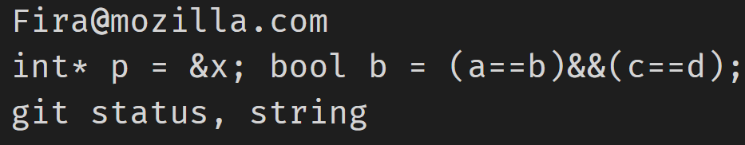

## Basic info
This work is based on: [Mozilla Fira](http://mozilla.github.io/Fira/)
Currently based on commit 5c8d9b.

This work is not based on [FiraCode](https://github.com/tonsky/FiraCode). 
I personally don't like font ligatures.

It changes 2 chars in Fira Mono, `&` and `@` (both comes from other open source font),
+ Fira Mono Mz: 

+ Original Fira Mono:


The `.ttf` files are fonts for download.
For normal users, just download those `.ttf` files and use them.
(Other things are only interesting for font hackers.)

Just like Fira Mono, this work is also free and open-source, 
and the license is the same as Fira Mono.


## Project Intro for font hackers
We have 3 font-forge prject files:
+ `FiraMonoMz-Bold.sfdir\`: font-forge project file for font `FiraMonoMz-Bold`.
+ `FiraMonoMz-Medium.sfdir\`: font-forge project file for font `FiraMonoMz-Medium`.
+ `FiraMonoMz-Regular.sfdir\`: font-forge project file for font `FiraMonoMz-Regular`.

### post-processing to make font be reconized as "Monospaced font"
If you make some changes to the font-forge prject, 
remember that after exporting your version of `.ttf` file using font-forge, 
you need to run following commands:
```sh
python fixmono.py FiraMonoMz-Regular.ttf
python fixmono.py FiraMonoMz-Medium.ttf
python fixmono.py FiraMonoMz-Bold.ttf
```
What is done: the script set the `isFixedPitch` of each font to `1`.
(You might need to install `fonttools` python package first. See `fixmono.py` for detail.)

See also: https://github.com/ryanoasis/nerd-fonts/blob/master/bin/scripts/fpfix.py

#### why need post-preocessing
See file `0 width glyph.log` (which is the output of 
`grep "^Width:" *.glyph > "../0 width glyph.log"`) for detail:
search for keyword 'Width: 0', you can see 27 chars have 0 width.

As a result, the font generated by font-forge will not set the `isFixedPitch` to 1, 
which makes some software couldn't recognize the font as Monospaced font.

See more about why font-forge do not automatically set `isFixedPitch`: http://fontforge.10959.n7.nabble.com/Regenerated-font-does-not-recognize-as-a-Monospace-in-Windows-td11291.html


